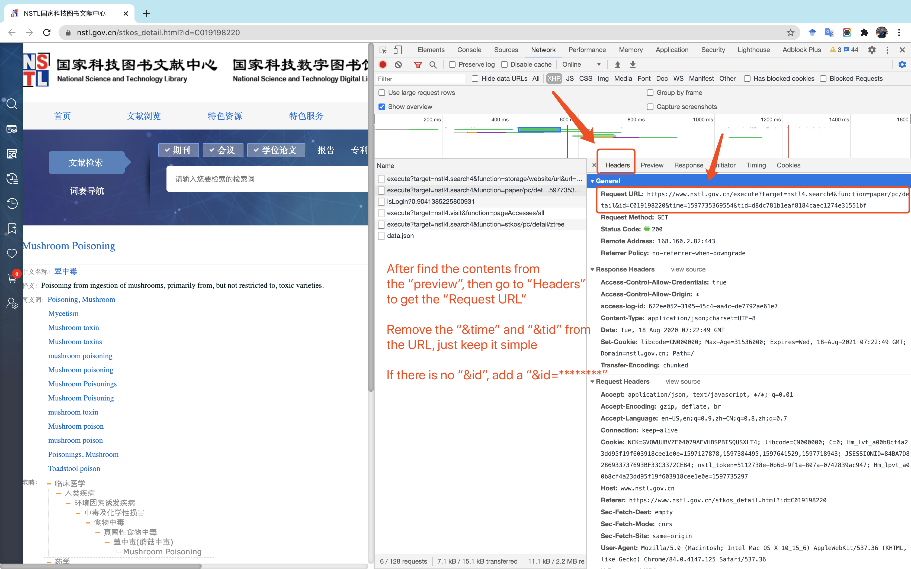

# Dynamic Webs crawlering in Python

## Tutorial for reptiling the NSTL Words (~620,000 words)

**Official Website**: https://www.nstl.gov.cn/

**Words Website**: https://www.nstl.gov.cn/stkos.html?t=Concept&q=

---

## Table of Contents

<ul>
<li><a href="#Usage-Demo">Usage Demo</a></li>
<li><a href="#Other-Useful-Resources">Other Useful Resources</a></li>
<li><a href="#Prevent-Anti-reptile">Prevent Anti-reptile</a></li>
<li><a href="#Links-of-the-Contents">Links of the Contents</a></li>
<li><a href="#ID-Order">ID Order</a></li>
<li><a href="#Announcement">Announcement</a></li>
<li><a href="#License">License</a></li>
</ul>

---

## Usage Demo

1. First of all, get all the words' IDs from the main page

    <p align="center">
    
    <br />
    <br />

    
    <br />
    <br />

    
    <br />
    <br />

    
    <br />
    <br />

    
    <br />
    <br />

    
    <br />
    <br />
    </p>

    For example: https://www.nstl.gov.cn/execute?target=nstl4.search4&function=paper/pc/list/pl&query=%7B%22c%22%3A10%2C%22st%22%3A%220%22%2C%22f%22%3A%5B%5D%2C%22p%22%3A%22%22%2C%22q%22%3A%5B%7B%22k%22%3A%22%22%2C%22v%22%3A%22%22%2C%22e%22%3A1%2C%22es%22%3A%7B%7D%2C%22o%22%3A%22AND%22%2C%22a%22%3A0%7D%5D%2C%22op%22%3A%22AND%22%2C%22s%22%3A%5B%22yea%3Adesc%22%5D%2C%22t%22%3A%5B%22Concept%22%5D%7D&sl=1&pageSize=10&pageNumber=1

    You can request this website instead to get the IDs from the page. You can change "&pageNumber=1" to "&pageNumber=100" to get the contents from Page 100. Please follow the codes "get-website-IDs.ipynb".

2. After get the IDs of words, use "fast-crawler-NSTL-data.ipynb" to download and capture all the contents from the websites.
    
    <p align="center">
    
    <br />
    <br />

    
    <br />
    <br />

    
    <br />
    <br />

    
    <br />
    <br />

    
    <br />
    <br />

    
    <br />
    <br />
    </p>

    The words will be saved as JSON format. 
    
    Good luck to your future reptile!

---

## Other Useful Resources

1. Python **selenium** package *(5 - 20 seconds for a website)*

   1). **Don't recommend this method** if there are tons of websites

   2). You need to download *Chrome Driver* to capture the websites.

   3). If you have (a) few dynamic websites, you can use "*selenium-reptile-script.py*" script.
       This file can be used as a Reference. After a little corrections, you can use this file.

2. Google Developer Tools -> Network -> Headers -> Request URL *(less than one second for a website)*

   1). Suggest to use this method.
   
   2). Use "*fast-reptile-script-YEAR2018.py*" script or follow "fast-crawler-NSTL-data.ipynb" script.

---

## Prevent Anti-reptile

1. Use a fake device instead of visiting directly
    ```python
    # A fake device to avoid the Anti reptile
    USER_AGENTS = [
        "Mozilla/4.0 (compatible; MSIE 6.0; Windows NT 5.1; SV1; AcooBrowser; .NET CLR 1.1.4322; .NET CLR 2.0.50727)",
        "Mozilla/4.0 (compatible; MSIE 7.0; Windows NT 6.0; Acoo Browser; SLCC1; .NET CLR 2.0.50727; Media Center PC 5.0; .NET CLR 3.0.04506)",
        "Mozilla/4.0 (compatible; MSIE 7.0; AOL 9.5; AOLBuild 4337.35; Windows NT 5.1; .NET CLR 1.1.4322; .NET CLR 2.0.50727)",
        "Mozilla/5.0 (Windows; U; MSIE 9.0; Windows NT 9.0; en-US)",
        "Mozilla/5.0 (compatible; MSIE 9.0; Windows NT 6.1; Win64; x64; Trident/5.0; .NET CLR 3.5.30729; .NET CLR 3.0.30729; .NET CLR 2.0.50727; Media Center PC 6.0)",
        "Mozilla/5.0 (compatible; MSIE 8.0; Windows NT 6.0; Trident/4.0; WOW64; Trident/4.0; SLCC2; .NET CLR 2.0.50727; .NET CLR 3.5.30729; .NET CLR 3.0.30729; .NET CLR 1.0.3705; .NET CLR 1.1.4322)",
        "Mozilla/4.0 (compatible; MSIE 7.0b; Windows NT 5.2; .NET CLR 1.1.4322; .NET CLR 2.0.50727; InfoPath.2; .NET CLR 3.0.04506.30)",
        "Mozilla/5.0 (Windows; U; Windows NT 5.1; zh-CN) AppleWebKit/523.15 (KHTML, like Gecko, Safari/419.3) Arora/0.3 (Change: 287 c9dfb30)",
        "Mozilla/5.0 (X11; U; Linux; en-US) AppleWebKit/527+ (KHTML, like Gecko, Safari/419.3) Arora/0.6",
        "Mozilla/5.0 (Windows; U; Windows NT 5.1; en-US; rv:1.8.1.2pre) Gecko/20070215 K-Ninja/2.1.1",
        "Mozilla/5.0 (Windows; U; Windows NT 5.1; zh-CN; rv:1.9) Gecko/20080705 Firefox/3.0 Kapiko/3.0",
        "Mozilla/5.0 (X11; Linux i686; U;) Gecko/20070322 Kazehakase/0.4.5",
        "Mozilla/5.0 (X11; U; Linux i686; en-US; rv:1.9.0.8) Gecko Fedora/1.9.0.8-1.fc10 Kazehakase/0.5.6",
        "Mozilla/5.0 (Windows NT 6.1; WOW64) AppleWebKit/535.11 (KHTML, like Gecko) Chrome/17.0.963.56 Safari/535.11",
        "Mozilla/5.0 (Macintosh; Intel Mac OS X 10_7_3) AppleWebKit/535.20 (KHTML, like Gecko) Chrome/19.0.1036.7 Safari/535.20",
        "Opera/9.80 (Macintosh; Intel Mac OS X 10.6.8; U; fr) Presto/2.9.168 Version/11.52",
    ]

    random_agent = USER_AGENTS[randint(0, len(USER_AGENTS) - 1)]
    headers = {
        'User-Agent': random_agent,
    }
    ```

2. Add a try-except-sleep to avoid "Refuse connection" and use timeout=(5, 10) to avoid Python "No response" Bug 

    ```python
    for j in range(10):
        try:
            res = requests.get(url, headers=headers, verify=False, timeout=(5, 10))
            contents = res.text
        except Exception as e:
            if j >= 9:
                print('The exception has happened', '-' * 100)
            else:
                time.sleep(0.5)
        else:
            time.sleep(0.5)
            break
    ```

3. Use SSL package and "verify=False" to disable Network Certificate
    
    ```python
    import ssl

    # Avoid SSL Certificate to access the HTTP website
    ssl._create_default_https_context = ssl._create_unverified_context
    ```

    or

    ```python
    res = requests.get(url, headers=headers, verify=False, timeout=(5, 10))
    contents = res.text
    ```

4. Use urllib3 package to disable warnings

    ```python
    import urllib3

    # Disable all kinds of warnings
    urllib3.disable_warnings()
    ```

5. Block current IP address

   1). Use a VPN software to change the IP address.

   2). Reptile the websites at home.

   3). Wait for 2 days to reptile if it's not urgent.

---

## Links of the Contents

I use an Example here, ID is **C018781660**:

To get ***English Term + Chinese Term + Synonyms***: [**Link**](https://www.nstl.gov.cn/execute?target=nstl4.search4&function=paper/pc/detail&id=C018781660)

To get ***Fields***: [**Link**](https://www.nstl.gov.cn/execute?target=nstl4.search4&function=stkos/pc/detail/ztree&id=C018781660)

To get **IDs** in a single page (~ 10 IDs in one page): [**Link**](https://www.nstl.gov.cn/execute?target=nstl4.search4&function=paper/pc/list/pl&query=%7B%22c%22%3A10%2C%22st%22%3A%220%22%2C%22f%22%3A%5B%5D%2C%22p%22%3A%22%22%2C%22q%22%3A%5B%7B%22k%22%3A%22%22%2C%22v%22%3A%22%22%2C%22e%22%3A1%2C%22es%22%3A%7B%7D%2C%22o%22%3A%22AND%22%2C%22a%22%3A0%7D%5D%2C%22op%22%3A%22AND%22%2C%22s%22%3A%5B%22yea%3Adesc%22%5D%2C%22t%22%3A%5B%22Concept%22%5D%7D&sl=1&pageSize=10&pageNumber=1)

---

## ID Order

In fact, there is an order for NSTL words w.r.t. different years, e.g., 2018, 2019, 2020, 
but I **don't recommend** you to use the order method because you might miss some words in this way.

In contrast, I think it is superior to **capture all the words' IDs first**,
and **then capture the contents w.r.t. these word IDs**.

All the words' IDs were crawlled and available as a [CSV file](https://github.com/SuperBruceJia/dynamic-web-crawlering-python/blob/master/NSTL-IDs.csv).

Orders for NSTL words:

**YEAR 2020**: C0200 + {29329 - 55000}    -->    19,960 Words

**YEAR 2019**: C019 + {000000 - 500000}   -->    395,093 Words

**YEAR 2018**: C018 + {781660 - 999999}   -->    199,906 Words

FYI, there are lots of blank pages in these IDs' website. You can look through and run the codes, and then you will find out.

Crawlered **614,888** words.

Until **August 18th, 2020**, there are **614,959** Words available.

---

## Announcement

These scripts and methods were mainly used to capture words contents from the NSTL word websites. 
However, I believe they can be transfered for other dynamic web crawlering besides the NSTL words.
So, enjoy your python crawlering and have a wonderful journey!

---

## License

MIT License
